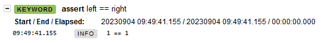
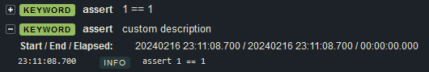
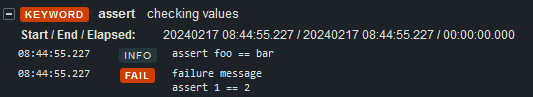

pass `--capture=no` to make `logger.console` work properly.

since this is a pytest plugin, you should avoid using robot options that have pytest equivalents:

| instead of...                           | use...                                | notes                                                                                                                                                    |
| :-------------------------------------- | :------------------------------------ | :------------------------------------------------------------------------------------------------------------------------------------------------------- |
| `robot --include tag_name`              | `pytest -m tag_name`                  |                                                                                                                                                          |
| `robot --exclude tag_name`              | `pytest -m not tag_name`              |                                                                                                                                                          |
| `robot --skip tag_name`                 | `pytest -m "not tag_name"`            |                                                                                                                                                          |
| `robot --test "test name" ./test.robot` | `pytest ./test.robot::"Test Name"`    |                                                                                                                                                          |
| `robot --suite "suite name" ./folder`   | `pytest ./folder`                     |                                                                                                                                                          |
| `robot --dryrun`                        | `pytest --collect-only`               | not exactly the same. you should use [a type checker](https://github.com/detachhead/basedpyright) on your python tests as a replacement for robot dryrun |
| `robot --exitonfailure`                 | `pytest --maxfail=1`                  |                                                                                                                                                          |
| `robot --rerunfailed`                   | `pytest --lf`                         |                                                                                                                                                          |
| `robot --runemptysuite`                 | `pytest --suppress-no-test-exit-code` | requires the [pytest-custom-exit-code](https://pypi.org/project/pytest-custom-exit-code/) plugin                                                         |
| `robot --help`                          | `pytest --help`                       | all supported robot options will be listed in the `robotframework` section                                                                               |

## specifying robot options directlty

there are multiple ways you can specify the robot arguments directly. however, arguments that have pytest equivalents cannot be set with robot as they would cause the plugin to behave incorrectly.

### pytest cli arguments

most robot cli arguments can be passed to pytest by prefixing the argument names with `--robot-`. for example, here's how to change the log level:

#### before

```
robot --loglevel DEBUG:INFO foo.robot
```

#### after

```
pytest --robot-loglevel DEBUG:INFO test_foo.py
```

you can see a complete list of the available arguments using the `pytest --help` command. any robot arguments not present in that list are not supported because they are replaced by a pytest equivalent (see [above](./configuration.md)).

### `pytest_robot_modify_options` hook

you can specify a `pytest_robot_modify_options` hook in your `conftest.py` to programmatically modify the arguments. see the [pytest_robotframework.hooks](http://detachhead.github.io/pytest-robotframework/pytest_robotframework/hooks.html#pytest_robot_modify_options) documentation for more information.

```py
from pytest_robotframework import RobotOptions
from robot.api.interfaces import ListenerV3

class Foo(ListenerV3):
    ...

def pytest_robot_modify_options(options: RobotOptions, session: Session) -> None:
    if not session.config.option.collectonly:
        options["loglevel"] = "DEBUG:INFO"
        options["listener"].append(Foo()) # you can specify instances as listeners, prerebotmodifiers, etc.
```

note that not all arguments that the plugin passes to robot will be present in the `args` list. arguments required for the plugin to function (eg. the plugin's listeners and prerunmodifiers) cannot be viewed or modified with this hook

### `ROBOT_OPTIONS` environment variable

```
ROBOT_OPTIONS="-d results --listener foo.Foo"
```

## enabling pytest assertions in the robot log

by default, only failed assertions will appear in the log. to make passed assertions show up, you'll have to add `enable_assertion_pass_hook = true` to your pytest ini options:

```toml
# pyproject.toml
[tool.pytest.ini_options]
enable_assertion_pass_hook = true
```



### hiding non-user facing assertions

you may have existing `assert` statements in your codebase that are not intended to be part of your tests (eg. for narrowing types/validating input data) and don't want them to show up in the robot log. there are two ways you can can hide individual `assert` statements from the log:

```py
from pytest_robotframework import AssertOptions, hide_asserts_from_robot_log

def test_foo():
    # hide a single passing `assert` statement:
    assert foo == bar, AssertOptions(log_pass=False)

    # hide a group of passing `assert` statements:
    with hide_asserts_from_robot_log():
        assert foo == bar
        assert bar == baz
```

note that failing `assert` statements will still show in the log regardless.

you can also run pytest with the `--no-assertions-in-robot-log` argument to disable `assert` statements in the robot log by default, then use `AssertOptions` to explicitly enable individual `assert` statements:

```py
from pytest_robotframework import AssertOptions

def test_foo():
    assert "foo" == "bar" # hidden from the robot log (when run with --no-assertions-in-robot-log)
    assert "bar" == "baz", AssertOptions(log_pass=True) # not hidden
```

### customizing assertions

pytest-robotframework allows you to customize the message for the `assert` keyword which appears on both passing and failing assertions:

```py
assert 1 == 1  # no custom description
assert 1 == 1, AssertOptions(description="custom description")
```



you can still pass a custom message to be displayed only when your assertion fails:

```py
assert 1 == 2, "the values did not match"
```

however if you want to specify both a custom description and a failure message, you can use the `fail_message` argument:

```py
assert 1 == 2, "failure message"
assert 1 == 2, AssertOptions(description="checking values", fail_message="failure message")
```



note that `enable_assertion_pass_hook` pytest option needs to be enabled for this to work.
