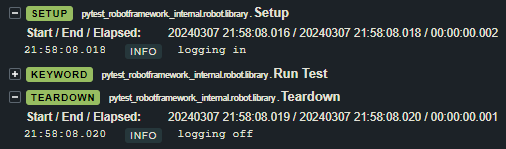
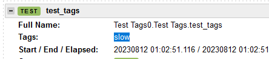
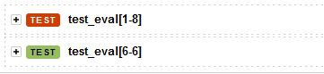

## write robot tests in python

```py
# you can use both robot and pytest features
from robot.api import logger
from pytest import Cache

from pytest_robotframework import keyword

@keyword  # make this function show as a keyword in the robot log
def foo():
    ...

@mark.slow  # markers get converted to robot tags
def test_foo():
    foo()
```

## run `.robot` tests

to allow for gradual adoption, the plugin also runs regular robot tests as well:

```robotframework
*** Settings ***
test setup  foo

*** Test Cases ***
bar
    [Tags]  asdf  key:value
    no operation

*** Keywords ***
foo
    log  ran setup
```

which is roughly equivalent to the following python code:

```py
# test_foo.py
from pytest import mark

@keyword
def foo():
    logger.info("ran setup")

@fixture(autouse=True)
def setup():
    foo()

@mark.asdf
@mark.key("value")
def test_bar():
    ...
```

## setup/teardown

in pytest, setups and teardowns are defined using fixtures:

```py
from pytest import fixture
from robot.api import logger

@fixture
def user():
    logger.info("logging in")
    user = ...
    yield user
    logger.info("logging off")

def test_something(user):
    ...
```

under the hood, pytest calls the fixture setup/teardown code as part of the `pytest_runtest_setup` and and `pytest_runtest_teardown` hooks, which appear in the robot log like so:



for more information, see the pytest documentation for [fixtures](https://docs.pytest.org/en/6.2.x/fixture.html) and [hook functions](https://docs.pytest.org/en/7.1.x/how-to/writing_hook_functions.html).

## tags/markers

pytest markers are converted to tags in the robot log:

```py
from pytest import mark

@mark.slow
def test_blazingly_fast_sorting_algorithm():
    [1,2,3].sort()
```



markers like `skip`, `skipif` and `parameterize` also work how you'd expect:

```py
from pytest import mark

@mark.parametrize("test_input,expected", [(1, 8), (6, 6)])
def test_eval(test_input: int, expected: int):
    assert test_input == expected
```



## robot suite variables

to set suite-level robot variables, call the `set_variables` function at the top of the test suite:

```py
from robot.libraries.BuiltIn import BuiltIn
from pytest_robotframework import set_variables

set_variables(
    {
        "foo": "bar",
        "baz": ["a", "b"],
    }
)

def test_variables():
    assert BuiltIn().get_variable_value("$foo") == "bar"
```

`set_variables` is equivalent to the `*** Variables ***` section in a `.robot` file. all variables are prefixed with `$`. `@` and `&` are not required since `$` variables can store lists and dicts anyway

## running tests in parallel

running tests in parallel using [pytest-xdist](https://pytest-xdist.readthedocs.io/en/stable/) is supported. when running with xdist, pytest-robotframework will run separate instances of robot for each test, then merge the robot output files together automatically using rebot.
