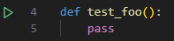
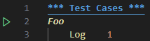

# IDE integrations

## vscode

vscode's builtin python plugin should discover both your python and robot tests by default, and show run buttons next to them:

### running `.robot` tests

if you still intend to use `.robot` files with pytest-robotframework, we recommend using the [robotcode](https://github.com/d-biehl/robotcode) extension and setting `robotcode.testExplorer.enabled` to `false` in `.vscode/settings.json`. this will prevent the tests from being duplicated in the test explorer.

## pycharm

pycharm currently does not support pytest plugins for non-python files. see [this issue](https://youtrack.jetbrains.com/issue/PY-63110/use-pytest-collect-only-to-collect-pytest-tests)
