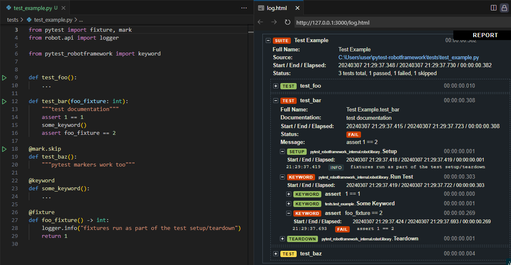

`pytest-robotframework` is a pytest plugin that creates robotframework reports for tests written
in python and allows you to run robotframework tests with pytest.

## Why use this?

you may want to use this plugin if any of the following applies to you:

- you want to use robotframework's reporting, but aren't a fan of the robot language and would prefer to write your tests in python
- your project contains both robotframework and pytest tests and you want to be able to run them both with the same tool
- you want to use other pytest plugins with your robotframework tests
