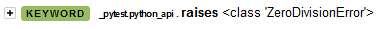

there are some limitations when writing robotframework tests in python. pytest-robotframework includes solutions for these issues.

## making keywords show in the robot log

by default when writing tests in python, the only keywords that you'll see in the robot log are `Setup`, `Run Test` and `Teardown`. this is because robot is not capable of recognizing keywords called outside of robot code. (see [this issue](https://github.com/robotframework/robotframework/issues/4252))

this plugin has several workarounds for the problem:

### `@keyword` decorator

if you want a function you wrote to show up as a keyword in the log, decorate it with the `pytest_robotframework.keyword` instead of `robot.api.deco.keyword`

```py
from pytest_robotframework import keyword

@keyword
def foo():
    ...
```

### pytest functions are patched by the plugin

most of the [pytest functions](https://docs.pytest.org/en/7.1.x/reference/reference.html#functions) are patched so that they show as keywords in the robot log

```py
def test_foo():
    with pytest.raises(ZeroDivisionError):
        logger.info(1 / 0)
```



#### patching third party functions with `keywordify`

if you want a function from a third party module/robot library to be displayed as a keyword, you can patch it with the `keywordify` function:

```py
# in your conftest.py

from pyest_robotframework import keywordify
import some_module

# patch a function from the module:
keywordify(some_module, "some_function")
# works on classes too:
keywordify(some_module.SomeClass, "some_method")
```

## continuable failures don't work

keywords that raise [`ContinuableFailure`](https://robotframework.org/robotframework/latest/RobotFrameworkUserGuide.html#continuable-failures) don't work properly when called from python code. this includes builtin keywords such as `Run Keyword And Continue On Failure`.

use `pytest.raises` for expected failures instead:

```py
from pytest import raises

with raises(SomeException):
    some_keyword_that_fails()
```

or if the exception is conditionally raised, use a `try`/`except` statement like you would in regular python code:

```py
try:
    some_keyword_that_fails()
except SomeException:
    ... # ignore the exception, or re-raise it later
```

the keyword will still show as failed in the log (as long as it's decorated with `pytest_robotframework.keyword`), but it won't effect the status of the test unless the exception is re-raised.

### why?

robotframework introduced `TRY`/`EXCEPT` statements in version 5.0, which they [now recommend using](https://robotframework.org/robotframework/latest/RobotFrameworkUserGuide.html#other-ways-to-handle-errors) instead of the old `Run Keyword And Ignore Error`/`Run Keyword And Expect Error` keywords.

however `TRY`/`EXCEPT` behaves differently to its python equivalent, as it allows for errors that do not actually raise an exception to be caught:

```robotframework
*** Test Cases ***
Foo
    TRY
        Run Keyword And Continue On Failure    Fail
        Log    this is executed
    EXCEPT
        Log    and so is this
    END
```

this means that if control flows like `Run Keyword And Continue On Failure` were supported, its failures would be impossible to catch:

```py
from robot.api.logger import info
from robot.libraries.BuiltIn import BuiltIn

try:
    BuiltIn().run_keyword_and_continue_on_failure("fail")
    info("this is executed because an exception was not actually raised")
except:
    info("this is NOT executed, but the test will still fail")
```
